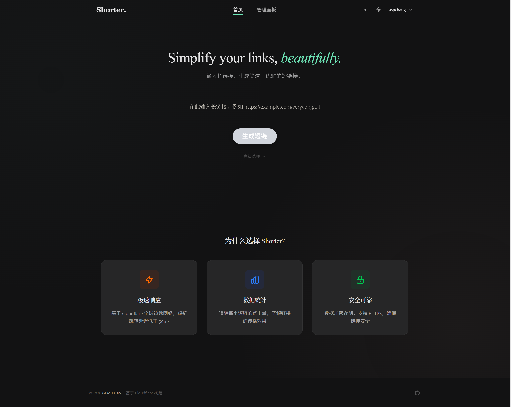
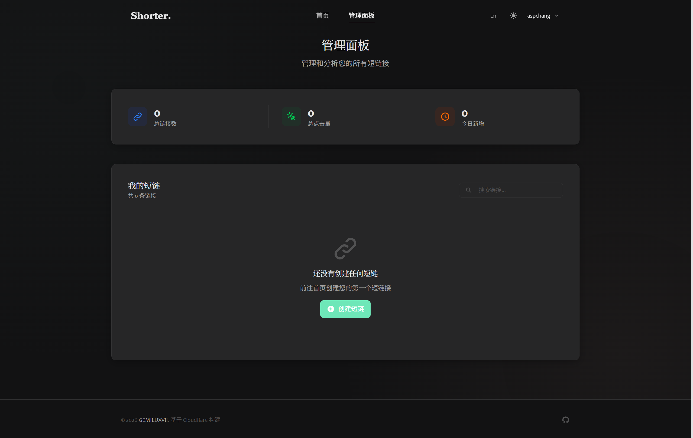

<div align="center">
  
</div>

# <div align="center">Shorter</div>

<div align="center">
  <strong>Modern URL Shortener | Elegant Link Management</strong>
</div>

<br>


<div align="center">
  <a href="https://github.com/GEMILUXVII/shorter/blob/main/LICENSE"></a>
  <a href="https://vuejs.org/"></a>
  <a href="https://vitejs.dev/"></a>
</div>

<div align="center">
  <a href="https://workers.cloudflare.com/"></a>
  <a href="https://developers.cloudflare.com/kv/"></a>
  <a href="#"></a>
</div>

<br>

<div align="center">
  <a href="#project-overview">Overview</a> |
  <a href="#features">Features</a> |
  <a href="#quick-start">Quick Start</a> |
  <a href="#deployment">Deployment</a> |
  <a href="https://shorter-7sc.pages.dev">Demo</a>
</div>

<div align="center">
  <a href="README.md">中文</a> | <strong>English</strong>
</div>

---

## Project Overview

Shorter is a modern, minimalist URL shortening service built with Vue 3 and deployed on Cloudflare Workers. It offers a clean, elegant user interface with support for dark mode and multi-language (Chinese/English) switching.

**Design Philosophy**: Fresh & Refined. We embrace natural, warm color tones (Sage Green, Cream), generous white space, and subtle animations to create a calm, focused user experience.

## Preview

<details>
<summary>Click to see interface preview</summary>
<div align="center">
  <h3>Home</h3>
  
  <br><br>
  <h3>Dashboard</h3>
  
</div>
</details>

## Features

- **Instant Link Generation**: Paste a long URL, get a short link immediately
- **Custom Short Codes**: Create memorable, branded short links
- **QR Code Generation**: Auto-generated QR codes for every short link
- **Click Analytics**: Track how many times each link has been clicked
- **Advanced Options**:
  - Link expiration (1 day, 7 days, 30 days, or never)
  - Password protection
  - Click limit
- **Dark Mode**: Elegant "Midnight Garden" theme with emerald accents
- **Internationalization**: Full support for Chinese and English with one-click switching
- **Responsive Design**: Seamless experience on desktop, tablet, and mobile
- **Edge Deployment**: Powered by Cloudflare Workers for ultra-low latency worldwide

## Quick Start

### Prerequisites

- Node.js 18+
- npm or pnpm
- Cloudflare account (for deployment)

### Local Development

```bash
# Clone the repository
git clone https://github.com/GEMILUXVII/shorter.git
cd shorter

# Install dependencies
npm install

# Start development server
npm run dev
```

The app will be available at `http://localhost:5173`.

### Build for Production

```bash
npm run build
```

## Deployment

Shorter is designed to be deployed on Cloudflare Workers with Cloudflare KV for storage.

### 1. Configure Wrangler

Copy the example configuration:

```bash
cp wrangler.toml.example wrangler.toml
```

Edit `wrangler.toml` and fill in your KV namespace IDs.

### 2. Create KV Namespaces

```bash
wrangler kv:namespace create "LINKS"
wrangler kv:namespace create "USERS"
```

### 3. Deploy

```bash
npm run build
npx wrangler pages deploy dist
```

For detailed deployment instructions, see [DEPLOY.md](DEPLOY.md).

## Tech Stack

| Category   | Technology                          |
| ---------- | ----------------------------------- |
| Frontend   | Vue 3, Vite, Tailwind CSS           |
| State      | Pinia                               |
| i18n       | vue-i18n                            |
| Backend    | Cloudflare Workers (Functions)      |
| Storage    | Cloudflare KV                       |
| Deployment | Cloudflare Pages                    |

## Project Structure

```
shorter/
├── public/                 # Static assets (favicon)
├── src/
│   ├── components/         # Vue components
│   │   ├── common/         # Base UI components
│   │   ├── features/       # Feature components (LinkGenerator, AuthModal, etc.)
│   │   └── layout/         # Layout components (AppHeader, AppFooter)
│   ├── composables/        # Vue composables (useClipboard, useToast, etc.)
│   ├── i18n/               # Internationalization
│   │   ├── locales/        # zh.js, en.js
│   │   └── index.js        # i18n configuration
│   ├── stores/             # Pinia stores
│   ├── views/              # Page components
│   └── style.css           # Global styles and CSS variables
├── functions/              # Cloudflare Workers API
├── index.html
├── vite.config.js
└── wrangler.toml
```

## License

[](https://www.gnu.org/licenses/agpl-3.0.txt)

Copyright (C) 2025 GEMILUXVII

This program is free software: you can redistribute it and/or modify it under the terms of the GNU Affero General Public License as published by the Free Software Foundation, either version 3 of the License, or any later version.

This program is distributed in the hope that it will be useful, but WITHOUT ANY WARRANTY; without even the implied warranty of MERCHANTABILITY or FITNESS FOR A PARTICULAR PURPOSE. See the GNU Affero General Public License for more details.

You should have received a copy of the GNU Affero General Public License along with this program. If not, see <https://www.gnu.org/licenses/>.
